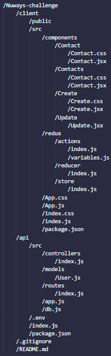

# Nuways-challenge

DEPLOY: https://addressbooknuways.netlify.app/

## 1. Instalación
Una vez se clone el repositorio se debera proceder a ejercutar el comando **npm install** en la carpeta api/ y carpeta client/

*En la carpeta api, se requiere crear un archivo .env, sin embargo, hay uno de ejemplo en el cual es requerida una URI de una base de datos PostgreSQL y el puerto donde escuchara la API.*

## 2. Librerias y tecnologias utilizadas.
Javascript, HTML, CSS, ReactJS, ReduxJs, NodeJS, ExpressJS, Sequelize, PostgreSQL

## 3. Estructura de directorios

## 4. No implemente WebSockets
